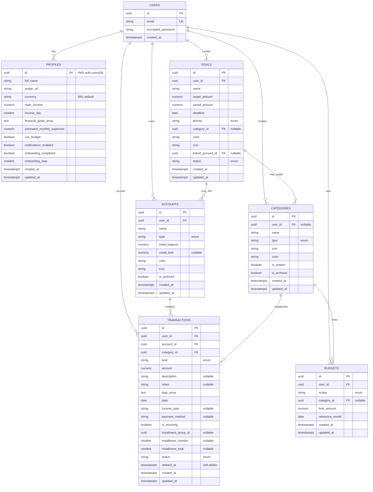

# 🗄️ Banco de Dados

Schema, tabelas, relacionamentos, índices e armadilhas conhecidas.

---

## 📊 Diagrama ER (Entidade-Relacionamento)

---

## 📋 Tabelas (Descrição detalhada)

### 1️⃣ `auth.users` (Gerenciada pelo Supabase)

**Função:** Usuários autenticados (email + password).

| Coluna | Tipo | Restrição | Notas |
|--------|------|-----------|-------|
| `id` | UUID | PK, gen_random_uuid() | Chave primária |
| `email` | TEXT | UK (unique) | E-mail único, case-insensitive |
| `encrypted_password` | TEXT | NOT NULL | Hash bcrypt |
| `email_confirmed_at` | TIMESTAMPTZ | Nullable | Confirmação de e-mail |
| `created_at` | TIMESTAMPTZ | NOT NULL | Timestamp criação |
| `updated_at` | TIMESTAMPTZ | NOT NULL | Último update |

**RLS:** Gerenciado pelo Supabase (não criar policies manualmente).

**⚠️ Notas:**
- Dados sensíveis (password) NUNCA selecionáveis via Postgrest
- JWT token inclui `sub = user_id`

---

### 2️⃣ `profiles`

**Função:** Dados complementares do usuário (onboarding, preferências).

| Coluna | Tipo | Restrição | Notas |
|--------|------|-----------|-------|
| `id` | UUID | PK, FK (auth.users.id) | Chave estrangeira com CASCADE |
| `full_name` | TEXT | NOT NULL DEFAULT '' | Nome completo |
| `avatar_url` | TEXT | Nullable | URL da foto de perfil |
| `currency` | TEXT | NOT NULL DEFAULT 'BRL' | Moeda global (BRL, USD, etc.) |
| `main_income` | NUMERIC(14,2) | Nullable | Renda principal mensal |
| `income_day` | SMALLINT | CHECK (1–31) | Dia do mês de recebimento |
| `financial_goals` | TEXT[] | DEFAULT '{}' | Array de objetivos (strings) |
| `estimated_monthly_expenses` | NUMERIC(14,2) | Nullable | Despesa estimada/mês |
| `use_budget` | BOOLEAN | NOT NULL DEFAULT false | Feature flag: orçamentos habilitados? |
| `notifications_enabled` | BOOLEAN | NOT NULL DEFAULT true | Quer receber notificações? |
| `onboarding_completed` | BOOLEAN | NOT NULL DEFAULT false | Flag: onboarding finalizado? |
| `onboarding_step` | SMALLINT | NOT NULL DEFAULT 0 | Step atual do onboarding |
| `created_at` | TIMESTAMPTZ | NOT NULL DEFAULT now() | Criação do perfil |
| `updated_at` | TIMESTAMPTZ | NOT NULL DEFAULT now() | Último update |

**RLS:**
- SELECT, INSERT, UPDATE, DELETE: `auth.uid() = id`

**⚠️ Armadilhas:**
- `currency` é GLOBAL para o usuário. Mudar moeda não converte histórico.
- `onboarding_step` incrementado manualmente (não há state machine).
- `financial_goals` é array livre (sem estrutura JSON).

---

### 3️⃣ `accounts`

**Função:** Contas do usuário (checking, savings, wallet, credit card, investment).

| Coluna | Tipo | Restrição | Notas |
|--------|------|-----------|-------|
| `id` | UUID | PK, gen_random_uuid() | Chave primária |
| `user_id` | UUID | NOT NULL FK (auth.users.id) | Proprietário |
| `name` | TEXT | NOT NULL | Ex: "Conta Banco X" |
| `type` | TEXT | CHECK (enum) | 'checking', 'savings', 'wallet', 'credit_card', 'investment', 'other' |
| `initial_balance` | NUMERIC(14,2) | NOT NULL DEFAULT 0 | Saldo inicial |
| `credit_limit` | NUMERIC(14,2) | Nullable | Limite de crédito (só para credit_card) |
| `color` | TEXT | NOT NULL DEFAULT '#10B981' | Cor (hex) |
| `icon` | TEXT | NOT NULL DEFAULT 'wallet' | Ícone (Lucide name) |
| `is_archived` | BOOLEAN | NOT NULL DEFAULT false | Conta ainda ativa? |
| `created_at` | TIMESTAMPTZ | NOT NULL DEFAULT now() | Criação |
| `updated_at` | TIMESTAMPTZ | NOT NULL DEFAULT now() | Último update |

**Índices:**
- `accounts_user_idx` on `(user_id)` — Buscar contas por usuário

**RLS:**
- ALL (SELECT, INSERT, UPDATE, DELETE): `auth.uid() = user_id`

**⚠️ Armadilhas:**
- **NÃO há soft-delete** (sem `deleted_at`). Account deletada desaparece.
- Transações que referenciam account deletada viola FK (RESTRICT).
- Saldo = `initial_balance` + SUM(transactions) — não armazenado, calculado.

---

### 4️⃣ `categories`

**Função:** Categorias de transação (rendas, despesas).

| Coluna | Tipo | Restrição | Notas |
|--------|------|-----------|-------|
| `id` | UUID | PK | Chave primária |
| `user_id` | UUID | FK (auth.users.id) | Proprietário (nullable para system categories) |
| `name` | TEXT | NOT NULL | Ex: "Alimentação", "Salário" |
| `type` | TEXT | CHECK (enum) | 'income', 'expense', 'both' |
| `icon` | TEXT | NOT NULL DEFAULT 'tag' | Ícone (Lucide name) |
| `color` | TEXT | NOT NULL DEFAULT '#10B981' | Cor (hex) |
| `is_system` | BOOLEAN | NOT NULL DEFAULT false | Categoria padrão (imutável)? |
| `is_archived` | BOOLEAN | NOT NULL DEFAULT false | Ativa? |
| `created_at` | TIMESTAMPTZ | NOT NULL DEFAULT now() | Criação |
| `updated_at` | TIMESTAMPTZ | NOT NULL DEFAULT now() | Último update |

**Índices:**
- `categories_user_idx` on `(user_id)` — Buscar categorias por usuário

**RLS:**
- SELECT: `auth.uid() = user_id OR is_system = true`
- INSERT: `auth.uid() = user_id AND is_system = false`
- UPDATE/DELETE: `auth.uid() = user_id AND is_system = false`

**⚠️ Armadilhas:**
- `is_system = true` são categorias padrão do sistema (Salário, Alimentação, etc.)
- Usuário PODE VER categorias system, mas NÃO PODE editar/deletar
- Sem lista clara do que são defaults. ⚠️ A confirmar em seed

---

### 5️⃣ `transactions`

**Função:** Receitas e despesas do usuário.

| Coluna | Tipo | Restrição | Notas |
|--------|------|-----------|-------|
| `id` | UUID | PK | Chave primária |
| `user_id` | UUID | NOT NULL FK | Proprietário |
| `account_id` | UUID | NOT NULL FK (RESTRICT) | Conta de origem |
| `category_id` | UUID | NOT NULL FK (RESTRICT) | Categoria |
| `kind` | TEXT | CHECK ('income' \| 'expense') | Tipo |
| `amount` | NUMERIC(14,2) | NOT NULL CHECK (>0) | Valor (sempre positivo) |
| `description` | TEXT | Nullable | Ex: "Supermercado Carrefour" |
| `notes` | TEXT | Nullable | Notas adicionais |
| `tags` | TEXT[] | NOT NULL DEFAULT '{}' | Array de tags (GIN indexed) |
| `date` | DATE | NOT NULL | Data da transação |
| `income_type` | TEXT | CHECK (enum) | 'salary', 'freelance', 'investment', 'sale', 'gift', 'refund', 'dividends', 'other' |
| `payment_method` | TEXT | CHECK (enum) | 'cash', 'debit', 'credit', 'pix', 'bank_slip', 'transfer' |
| `is_recurring` | BOOLEAN | NOT NULL DEFAULT false | Transação recorrente? |
| `installment_group_id` | UUID | Nullable | Agrupa parcelamentos |
| `installment_number` | SMALLINT | Nullable | Número da parcela (1, 2, ...) |
| `installment_total` | SMALLINT | Nullable | Total de parcelas |
| `status` | TEXT | CHECK ('paid' \| 'pending') | Paga ou pendente? |
| `deleted_at` | TIMESTAMPTZ | Nullable | Soft-delete |
| `created_at` | TIMESTAMPTZ | NOT NULL DEFAULT now() | Criação |
| `updated_at` | TIMESTAMPTZ | NOT NULL DEFAULT now() | Último update |

**Índices:**
- `tx_user_date_idx` on `(user_id, date DESC)` — Listar por mês
- `tx_user_kind_idx` on `(user_id, kind)` — Filtrar receita/despesa
- `tx_user_category_idx` on `(user_id, category_id)` — Por categoria
- `tx_installment_idx` on `(installment_group_id)` — Relacionar parcelas
- `tx_tags_idx` on `(tags)` using GIN — Buscar por tags

**RLS:**
- ALL: `auth.uid() = user_id`

**⚠️ Armadilhas:**
1. **Parcelamentos SEM tabela central** — Agrupa por `installment_group_id` (UUID)
   - Se deletar uma parcela, quebra grupo
   - Se editar uma, precisa sincronizar todas as outras
2. **Soft-delete: `deleted_at` NOT NULL** — Aplicação deve filtrar
3. **Amount sempre positivo** — Kind ('income'/'expense') determina sinal
4. **Tags é array** — Busca com `@>` ou GIN operator
5. **Sem validação que installment_number <= installment_total** — Cuidado em validação

---

### 6️⃣ `budgets`

**Função:** Orçamentos mensais (global ou por categoria).

| Coluna | Tipo | Restrição | Notas |
|--------|------|-----------|-------|
| `id` | UUID | PK | Chave primária |
| `user_id` | UUID | NOT NULL FK | Proprietário |
| `scope` | TEXT | CHECK ('general' \| 'category') | Tipo de orçamento |
| `category_id` | UUID | FK (CASCADE) | Se scope='category', qual categoria |
| `limit_amount` | NUMERIC(14,2) | NOT NULL CHECK (>0) | Limite de gasto |
| `reference_month` | DATE | NOT NULL | Mês (ex: '2026-06-01') |
| `created_at` | TIMESTAMPTZ | NOT NULL DEFAULT now() | Criação |
| `updated_at` | TIMESTAMPTZ | NOT NULL DEFAULT now() | Último update |

**Constraints:**
- `UNIQUE (user_id, scope, COALESCE(category_id::text, ''), reference_month)` — Evitar duplicatas

**RLS:**
- ALL: `auth.uid() = user_id`

**⚠️ Armadilhas:**
- `reference_month` é apenas DATE (dia 1 do mês)
- Sem validação que scope='category' + category_id válida
- Usuário pode ter apenas 1 orçamento global/mês

---

### 7️⃣ `goals`

**Função:** Metas financeiras (poupança, viagem, etc.).

| Coluna | Tipo | Restrição | Notas |
|--------|------|-----------|-------|
| `id` | UUID | PK | Chave primária |
| `user_id` | UUID | NOT NULL FK | Proprietário |
| `name` | TEXT | NOT NULL | Ex: "Viagem para Miami" |
| `target_amount` | NUMERIC(14,2) | NOT NULL CHECK (>0) | Valor alvo |
| `saved_amount` | NUMERIC(14,2) | NOT NULL DEFAULT 0 CHECK (>=0) | Quanto já economizou |
| `deadline` | DATE | NOT NULL | Data limite |
| `priority` | TEXT | CHECK ('low' \| 'medium' \| 'high') | Prioridade |
| `category_id` | UUID | FK (SET NULL) | Categoria associada (opcional) |
| `color` | TEXT | NOT NULL DEFAULT '#10B981' | Cor |
| `icon` | TEXT | NOT NULL DEFAULT 'target' | Ícone |
| `linked_account_id` | UUID | FK (SET NULL) | Conta poupança associada (opcional) |
| `status` | TEXT | CHECK ('active' \| 'completed' \| 'archived') | Status |
| `created_at` | TIMESTAMPTZ | NOT NULL DEFAULT now() | Criação |
| `updated_at` | TIMESTAMPTZ | NOT NULL DEFAULT now() | Último update |

**RLS:**
- ALL: `auth.uid() = user_id`

**⚠️ Armadilhas:**
- `saved_amount` é manual (não sincroniza com transações automaticamente)
- `deadline` pode estar no passado (app deve validar)
- Sem progresso automático (ex: % de realização)

---

## 🔑 Índices críticos

| Nome | Tabela | Colunas | Por quê |
|------|--------|---------|---------|
| `accounts_user_idx` | accounts | `(user_id)` | Listar contas rápido |
| `categories_user_idx` | categories | `(user_id)` | Listar categorias rápido |
| `tx_user_date_idx` | transactions | `(user_id, date DESC)` | **CRÍTICO** — Listar por mês |
| `tx_user_kind_idx` | transactions | `(user_id, kind)` | Filtrar receita/despesa |
| `tx_user_category_idx` | transactions | `(user_id, category_id)` | Filtrar por categoria |
| `tx_installment_idx` | transactions | `(installment_group_id)` | Buscar parcelas relacionadas |
| `tx_tags_idx` | transactions | `(tags)` GIN | Buscar por tags |
| `budgets_unique_scope` | budgets | `(user_id, scope, category_id, reference_month)` | Evitar duplicatas |

---

## 🚨 Armadilhas e problemas conhecidos

| # | Problema | Severidade | Impacto |
|-|----------|-----------|---------|
| 1 | Parcelamentos sem tabela central — editando uma parcela quebra grupo | Alto | Integridade de dados |
| 2 | Soft-delete de transações, mas accounts deletadas violarão FK | Alto | Perda de dados |
| 3 | Moeda global (profiles.currency) — histórico fica em moeda antiga | Alto | Relatórios incorretos |
| 4 | `saved_amount` em goals é manual (não sincroniza) | Médio | Dados desincronizados |
| 5 | Categorias system — lista não documentada, sem seed | Médio | Categorias faltando |
| 6 | Sem auditoria de mudanças (quem deletou? quando?) | Alto | Compliance/debugging |
| 7 | `installment_number` pode não ser <= `installment_total` (sem constraint) | Médio | Validação app-side |
| 8 | `created_at` não muda ao UPDATE (convencional, mas pode confundir) | Baixo | Histórico |

---

## 📚 Relacionado

- **Visão de Arquitetura:** [[Visão-de-Arquitetura.md]]
- **Variáveis de Ambiente:** [[Variáveis-de-Ambiente.md]]
- **Mapa de Regressão:** [[Mapa-de-Regressão.md]]
- **Fluxo de Transações:** [[../Fluxos/Contas-e-Transacoes.md]]

---

**Versão:** 1.0  
**Última atualização:** 2026-06-29
