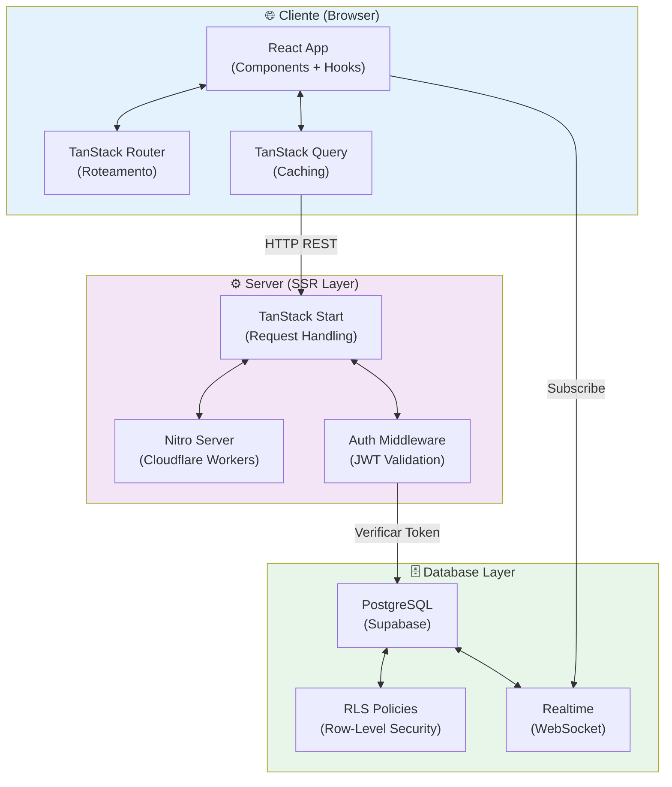
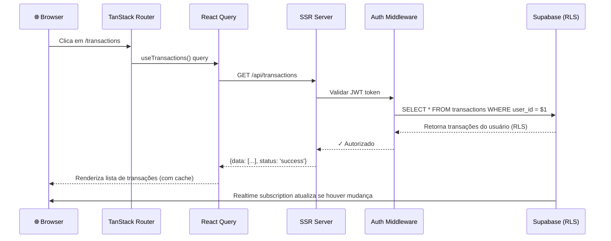
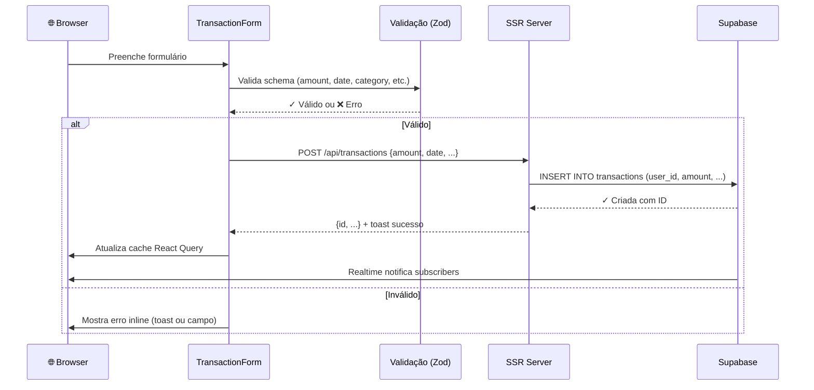
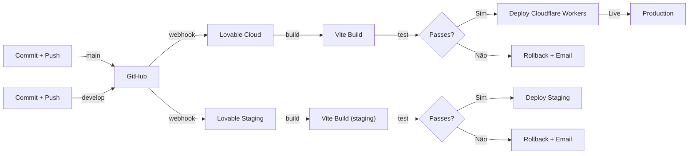

# 🏗️ Visão de Arquitetura

Diagrama de componentes, fluxo de dados e decisões arquiteturais.

---

## 📐 Diagrama de Arquitetura (Alto nível)



---

## 🔄 Fluxo de Dados

### Fluxo 1: Carregar Transações



### Fluxo 2: Criar Transação (com validação)



---

## 🗂️ Estrutura de Camadas

```
src/
├── routes/                 # TanStack Router (file-based)
│   ├── __root.tsx         # Root layout + error boundary
│   ├── auth.tsx           # /auth (signup/login)
│   ├── index.tsx          # / (landing)
│   └── _authenticated/    # Protected routes (requer JWT)
│       ├── dashboard.tsx
│       ├── transactions.tsx
│       ├── budgets.tsx
│       ├── accounts.tsx
│       ├── categories.tsx
│       ├── goals.tsx
│       └── settings.tsx
│
├── components/            # React Components
│   ├── ui/               # Radix UI + Shadcn (input, button, etc.)
│   ├── page.tsx          # Layouts de página
│   └── transaction-form.tsx  # Formulários específicos
│
├── hooks/                # React Hooks customizados
│   ├── use-current-user.ts
│   └── use-mobile.tsx
│
├── lib/                  # Utilitários
│   ├── queries.ts        # useAccounts, useTransactions, etc.
│   ├── format.ts         # Datas, moedas, conversões
│   ├── utils.ts          # Helpers gerais
│   ├── error-page.ts     # UI de erro
│   └── lovable-error-reporting.ts  # Logging
│
├── integrations/         # Integrações externas
│   └── supabase/
│       ├── client.ts     # Client-side Supabase
│       ├── client.server.ts  # Server-side Supabase
│       ├── auth-middleware.ts  # JWT validation
│       ├── auth-attacher.ts    # Attach user to request
│       └── types.ts      # TypeScript types (auto-gerado)
│
├── router.tsx            # Configuração TanStack Router
├── routeTree.gen.ts      # Auto-gerado pelo TanStack
├── server.ts             # SSR entry point (TanStack Start)
├── start.ts              # App entry point
└── styles.css            # Global styles (Tailwind)
```

---

## 🎯 Decisões Arquiteturais

### 1. **TanStack Start + Nitro (SSR + Type-Safe)**
- ✅ SSR renderiza HTML inicial (melhor SEO + performance)
- ✅ Middleware de autenticação na borda (Cloudflare Workers)
- ✅ Roteamento file-based (simples, escalável)
- ⚠️ Adiciona complexidade (SSR vs CSR tradeoff)

### 2. **React Query (TanStack Query)**
- ✅ Caching automático
- ✅ Refetch e sincronização em background
- ✅ Realtime subscriptions (Supabase)
- ⚠️ Deve ser sincronizado com estado local se houver

### 3. **Supabase RLS (Row-Level Security)**
- ✅ Segurança em nível de DB (não apenas API)
- ✅ Impossível cliente contornar auth
- ⚠️ Policies complexas = bugs silenciosos

### 4. **Zod para validação**
- ✅ Type-safe schemas
- ✅ Mesmo schema front e back (potencialmente)
- ✅ Mensagens de erro customizáveis

### 5. **Tailwind + Radix UI**
- ✅ Design system consistente
- ✅ Componentes acessíveis (a11y)
- ✅ Dark mode suportado

---

## 🔌 Pontos de integração

### 1. **Supabase (Database + Auth)**
- URL: `VITE_SUPABASE_URL` (env var)
- Key: `VITE_SUPABASE_PUBLISHABLE_KEY` (env var)
- Operações: SELECT, INSERT, UPDATE, DELETE via Postgrest API
- Realtime: WebSocket para atualizações em tempo real

### 2. **Lovable Cloud (Deploy)**
- Deployment automático on `git push main`
- Environment variables gerenciadas no painel Lovable
- Staging: branch `develop` (⚠️ verificar se habilitado)

### 3. **GitHub (Version Control)**
- Sync bidirecional com Lovable
- ⚠️ Evitar force-push (reescreve história no Lovable)

---

## ⚡ Performance

### Otimizações já implementadas:
- ✅ Code splitting automático (Vite)
- ✅ Tailwind CSS tree-shaking (PurgeCSS)
- ✅ React Query caching
- ✅ Lazy loading de componentes

### Potenciais melhorias:
- 🔲 Image optimization (next-image-like)
- 🔲 Virtual scrolling para listas grandes (> 500 items)
- 🔲 Memoization de componentes pesados (React.memo)

---

## 🔐 Segurança

### Já implementado:
- ✅ JWT validation no server (auth-middleware.ts)
- ✅ RLS policies em todas as tabelas
- ✅ user_id forçado em INSERT/UPDATE (via CHECK constraint ou trigger)
- ✅ Sensitive data (senha) não exposta

### Recomendações:
- 📌 Adicionar rate-limiting em login/signup
- 📌 CSRF tokens em forms (TanStack Start já pode ajudar)
- 📌 Auditoria de mudanças sensíveis (criar tabela audit_log)

---

## 📌 Arquivos críticos — Ler antes de tocar

| Arquivo | Por quê | Risco se mudar |
|---------|---------|---|
| [src/integrations/supabase/auth-middleware.ts](../src/integrations/supabase/auth-middleware.ts) | Valida JWT em toda requisição | Quebra autenticação |
| [src/lib/queries.ts](../src/lib/queries.ts) | Todas as queries React Query | Queries faltam, dados não carregam |
| [supabase/migrations/](../../supabase/migrations/) | Schema do banco | Perda de dados |
| [src/routes/](../src/routes/) | Roteamento da app | Links quebram, componentes não carregam |
| [src/components/ui/](../src/components/ui/) | Design system | UI quebra em vários lugares |

---

## 🚀 Deploy Pipeline



---

## 📚 Relacionado

- **Estrutura de Pastas:** [[Estrutura-de-Pastas.md]]
- **Banco de Dados:** [[Banco-de-Dados.md]]
- **Fluxos:** [[../Fluxos/Autenticacao-e-Onboarding.md]]
- **Segurança:** [[../Segurança/Modelo-de-Ameacas.md]]

---

**Versão:** 1.0  
**Última atualização:** 2026-06-29
