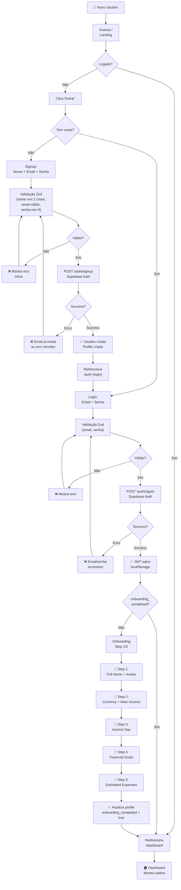
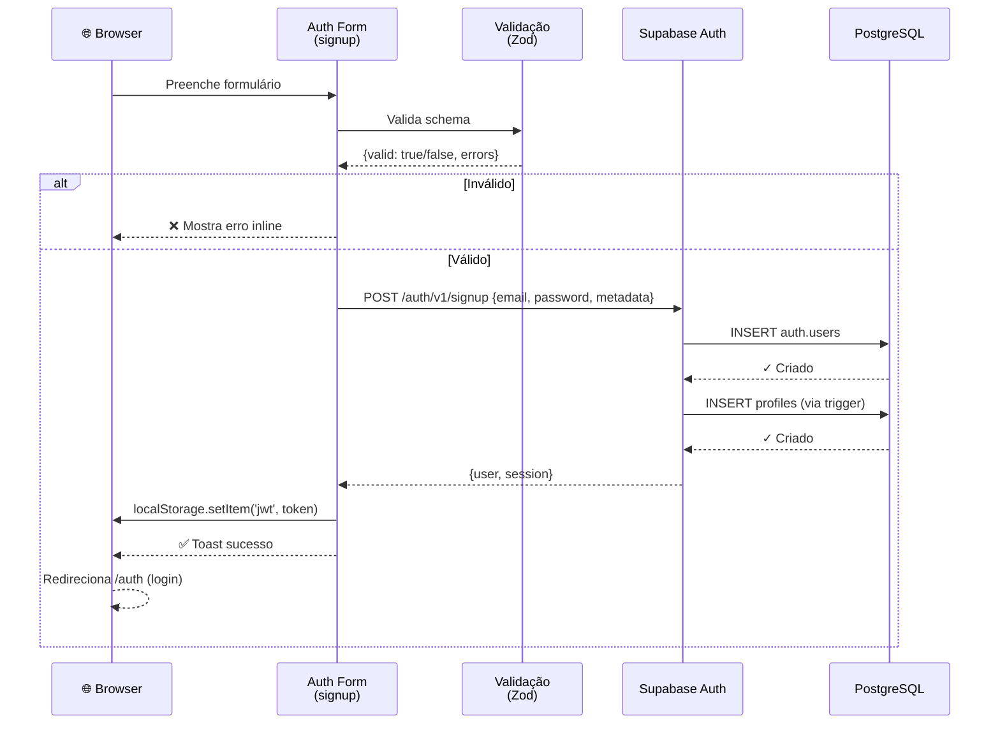
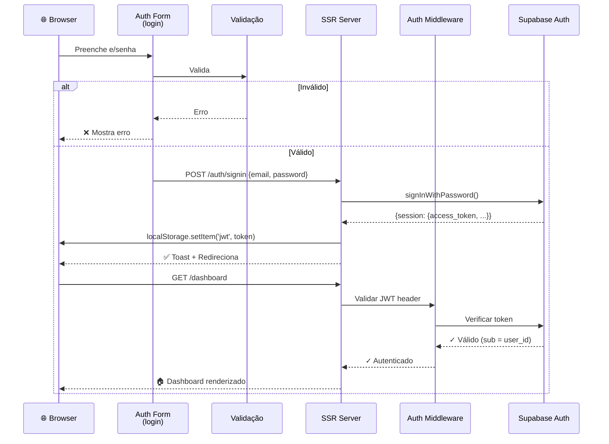

# 🔄 Autenticação e Onboarding

Fluxo completo de signup, login e onboarding do usuário.

---

## 📊 Diagrama de Fluxo



---

## 🔐 Sequência Detalhada: Signup



---

## 🔐 Sequência Detalhada: Login



---

## 🎯 Fluxo de Onboarding (Passo a passo)

### Step 1: Full Name + Avatar

**Tela:**
```
┌──────────────────────────────┐
│   Bem-vindo ao FinFlow!      │
│                              │
│  Qual é seu nome?            │
│  [________________]          │
│                              │
│  Foto de perfil (opcional)   │
│  [Escolher arquivo]          │
│                              │
│  [Próximo →]  [Pular]        │
└──────────────────────────────┘
```

**Validações:**
- Nome: mín 2 chars, máx 80
- Foto: JPEG/PNG, máx 5MB (salva em Supabase Storage)

**Ação:** UPDATE profiles SET full_name, avatar_url, onboarding_step=2

---

### Step 2: Currency + Main Income

**Tela:**
```
┌──────────────────────────────┐
│   Sua moeda e renda          │
│                              │
│  Que moeda você usa?         │
│  [Dropdown: BRL, USD, EUR]   │
│                              │
│  Qual sua renda mensal?      │
│  [____________] BRL          │
│                              │
│  [← Anterior] [Próximo →]    │
└──────────────────────────────┘
```

**Validações:**
- Currency: lista pré-definida
- Main income: número positivo (opcional)

**Ação:** UPDATE profiles SET currency, main_income, onboarding_step=3

---

### Step 3: Income Day

**Tela:**
```
┌──────────────────────────────┐
│   Quando você recebe?        │
│                              │
│  Dia do recebimento          │
│  [Slider: 1 - 31]   Dia 5    │
│                              │
│  [← Anterior] [Próximo →]    │
└──────────────────────────────┘
```

**Validações:**
- Day: 1–31
- Default: 1

**Ação:** UPDATE profiles SET income_day, onboarding_step=4

---

### Step 4: Financial Goals

**Tela:**
```
┌──────────────────────────────┐
│   Seus objetivos             │
│                              │
│  Quais são seus objetivos?   │
│  ☐ Poupar para viagem        │
│  ☐ Emergência (3 meses)      │
│  ☐ Investir                  │
│  ☐ Aposentadoria             │
│                              │
│  [← Anterior] [Próximo →]    │
└──────────────────────────────┘
```

**Validações:**
- Deve selecionar pelo menos 1

**Ação:** UPDATE profiles SET financial_goals, onboarding_step=5

---

### Step 5: Estimated Monthly Expenses

**Tela:**
```
┌──────────────────────────────┐
│   Suas despesas              │
│                              │
│  Gasto mensal estimado       │
│  [____________] BRL          │
│                              │
│  Usar orçamentos?            │
│  ◉ Sim  ○ Não                │
│                              │
│  [← Anterior] [Concluir]     │
└──────────────────────────────┘
```

**Validações:**
- Número positivo (opcional)

**Ação:** UPDATE profiles SET estimated_monthly_expenses, use_budget, onboarding_completed=true, onboarding_step=0

---

## 🔒 Segurança: Fluxo de JWT

```
1. User faz login → Supabase retorna JWT
2. App salva em localStorage (com persistSession=true)
3. A cada requisição, header Authorization: Bearer <JWT>
4. SSR middleware valida JWT:
   - Decodifica (sem verify, é assinado por Supabase)
   - Extrai sub (user_id)
   - Passa para queries RLS
5. RLS verifica auth.uid() vs user_id
6. Se token expirado → refresh automático (via Supabase)
```

**⚠️ Nota:** localStorage não é super seguro (XSS pode roubar token).  
Mitigação: CSP, sanitizar inputs, usar httpOnly cookies (futuro).

---

## ⚠️ Fluxos alternativos

### Erro: Email já existe

```
Usuário A tenta signup com email que já existe
          ↓
Supabase retorna erro 400
          ↓
App mostra: "E-mail já está registrado. [Faça login]"
          ↓
Usuário clica link → Página de login
```

### Erro: Senha fraca

```
Usuário tenta senha com 5 caracteres
          ↓
Zod valida (min 8)
          ↓
App mostra inline: "Senha deve ter mín 8 caracteres"
          ↓
Usuário corrige e tenta novamente
```

### Usuário esqueceu senha (Futuro)

```
Na página de login, link "Esqueceu a senha?"
          ↓
Usuário entra email
          ↓
Supabase envia link de reset
          ↓
Usuário clica link no e-mail
          ↓
Redireciona para /auth/reset-password?token=xxx
          ↓
Usuário define nova senha
          ↓
Login com nova senha
```

**Status:** ⚠️ Não implementado ainda

---

## 📊 Estados possíveis durante fluxo

| Estado | Descrição | Ação |
|--------|-----------|------|
| `loading` | Enviando dados para Supabase | Desabilitar botão submit |
| `error` | Erro na requisição | Mostrar mensagem, permitir retry |
| `success` | Onboarding concluído | Redirecionar /dashboard |
| `validating` | Validando Zod schema | Mostrar erros inline |

---

## 🧪 Teste: Checklist

- [ ] Signup com nome/email/senha válidos → cria usuário?
- [ ] Signup com email duplicado → erro "já existe"?
- [ ] Signup com senha < 8 chars → erro inline?
- [ ] Login com email/senha corretos → acessar dashboard?
- [ ] Login com senha errada → erro "incorretos"?
- [ ] Logout → localStorage limpo, redirecionado /auth?
- [ ] Onboarding Step 1 completo → Step 2 acessível?
- [ ] Pular Step → ainda avança?
- [ ] Voltar em Step → dados permanecem?
- [ ] Concluir onboarding → onboarding_completed=true?
- [ ] Recarregar página durante onboarding → mantém step?
- [ ] Já logado, acessa /auth → redireciona /dashboard?

---

## 📚 Relacionado

- **Banco de Dados:** [[../Arquitetura/Banco-de-Dados.md]]
- **Auth & Permissões:** [[../Sistemas/Auth-e-Permissoes.md]]
- **Arquivo auth.tsx:** [[../../src/routes/auth.tsx]]

---

**Versão:** 1.0  
**Última atualização:** 2026-06-29
