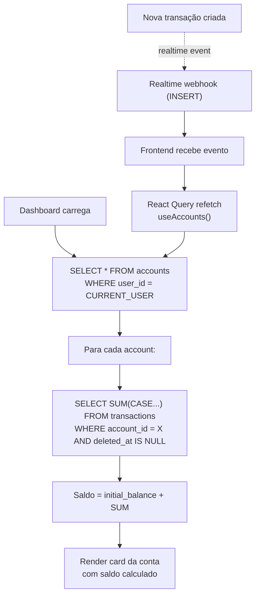

# 🧮 Cálculo de Saldos

Como saldos são calculados, sincronizados e atualizados em tempo real.

---

## 📊 Fórmula Base

```
Saldo da Conta = initial_balance + SUM(
  CASE 
    WHEN kind = 'income' THEN +amount
    WHEN kind = 'expense' THEN -amount
  END
)
  WHERE account_id = <conta>
  AND deleted_at IS NULL
```

**Exemplo prático:**
```
Conta: "Minha Conta Corrente"
├── initial_balance: R$ 1.000
├── + Transação 1 (income, salary): R$ 3.000
│   └─ Saldo intermediate: R$ 4.000
├── - Transação 2 (expense, food): R$ 200
│   └─ Saldo intermediate: R$ 3.800
├── - Transação 3 (expense, parcelada 1/3): R$ 300
├── - Transação 4 (expense, parcelada 2/3): R$ 300
├── - Transação 5 (expense, parcelada 3/3): R$ 300
│   └─ Saldo final: R$ 2.800
```

---

## 🔄 Fluxo de Cálculo (Realtime)



---

## 🔢 Tipos de Saldo

### 1. Saldo Disponível (Current)

```
Saldo Disponível = initial_balance + SUM(transações pagas)

Usa: status = 'paid'
Mostra no dashboard principal
Cor: Verde (se positivo)
```

### 2. Saldo Pendente (Futuro)

```
Saldo Pendente = SUM(transações com status = 'pending')

Usa: status = 'pending'
Mostra em widget secundário
Cor: Amarelo (aviso)
Exemplo: "Receita pendente: +R$500"
```

### 3. Saldo Teórico (Horizonte)

```
Saldo Teórico = Saldo Disponível + Saldo Pendente

Mostra: "Com transações pendentes: R$X"
Cor: Neutro
Propósito: Planejamento
```

---

## ⏱️ Timing do Cálculo

### Operação: Criar transação

```
1. Usuário submete (t=0)
   ↓
2. Frontend valida com Zod (t=0ms)
   ✓ Válido → continua
   ✗ Inválido → mostra erro, retorna
   ↓
3. Frontend envia POST /transactions (t=5ms)
   ↓
4. Servidor: INSERT em DB (t=20ms)
   ↓
5. RLS policy valida auth.uid() (t=22ms)
   ✓ Autorizado → transação criada
   ✗ Negado → erro 403
   ↓
6. Supabase envia Realtime event (t=25ms)
   ↓
7. Frontend recebe evento
   ↓
8. React Query refetch (t=30ms)
   ├─ SELECT SUM(...) executa
   ├─ Novo saldo calculado
   └─ UI re-renderiza
   ↓
9. Dashboard atualizado (t=50ms) ✅
```

**Total: ~50ms** (quase imperceptível)

---

## 💰 Casos especiais

### Credit Card (Saldo Negativo)

```
Credit Card tem credit_limit

Limite: R$5.000 (crédito disponível)

Transações:
- initial_balance = 0 (ou saldo já gasto)
- Compra: -R$1000 → Saldo = -R$1000 (dívida)
- Compra: -R$2000 → Saldo = -R$3000 (dívida)

Saldo Disponível = -R$3000
Crédito Restante = credit_limit - |saldo| = R$5000 - R$3000 = R$2000

Display: "Saldo: -R$3000 | Crédito disponível: R$2000"
Cor: 🔴 Vermelho (negativo)
```

---

### Parcelamentos

```
Parcelamento: 3x R$1000 (total R$3000)

Três transações SEPARADAS, cada uma com:
- amount: 1000
- installment_group_id: 'xxx-xxx'
- installment_number: 1, 2, 3
- installment_total: 3

Saldo = initial_balance - 1000 - 1000 - 1000 = -R$3000

Se usuário deletar parcela 2:
❌ Opção 1: Deixa inconsistência (saldo estranho)
✅ Opção 2: Delete todas as parcelas (sistema)

Implementação: Opção 2 (cascade delete por installment_group_id)
```

---

### Soft-Delete

```
Transação com deleted_at NOT NULL não conta para saldo

Exemplo:
- Saldo antes: R$2000
- Transação -R$500: Saldo = R$1500
- User deleta: UPDATE ... SET deleted_at = now()
- Saldo após: R$2000 (como se não existisse)

Query: ... AND deleted_at IS NULL
```

---

## 📊 Widget de Saldos (Dashboard)

```
┌─────────────────────────────────────────┐
│           Resumo de Contas              │
├─────────────────────────────────────────┤
│                                         │
│  🏦 Minha Conta Corrente (Banco X)    │
│     Saldo: R$ 4.250,00                 │
│     Tipo: Corrente                     │
│                                         │
│  💰 Poupança (CDB)                     │
│     Saldo: R$ 8.500,00                 │
│     Tipo: Poupança                     │
│                                         │
│  💳 Cartão Crédito Itau                │
│     Saldo: -R$ 3.200,00 (dívida)       │
│     Limite: R$ 5.000,00                │
│     Disponível: R$ 1.800,00            │
│                                         │
│  👛 Carteira (Cash)                    │
│     Saldo: R$ 150,00                   │
│     Tipo: Dinheiro vivo                │
│                                         │
├─────────────────────────────────────────┤
│  TOTAL CONSOLIDADO:                    │
│  R$ 10.200,00 (considerando débitos)   │
└─────────────────────────────────────────┘
```

---

## 🧮 Total Consolidado

```
Total Consolidado = SUM(saldos de todas as contas)
                  = R$4250 + R$8500 - R$3200 + R$150
                  = R$10.200

⚠️ NOTA: Carros e imóveis (bens) NÃO entram aqui
         Sistema é para fluxo de dinheiro, não patrimônio
```

---

## 🔄 Sincronização em Tempo Real

### Setup Realtime Supabase

```typescript
// [src/integrations/supabase/client.ts] (já configurado)
supabase
  .channel(`transactions:${userId}`)
  .on('postgres_changes',
    { event: '*', schema: 'public', table: 'transactions' },
    (payload) => {
      console.log('Transação mudou:', payload);
      // React Query refetch automático
    }
  )
  .subscribe();
```

### Quando Refetch Acontece

| Evento | Trigger | Delay |
|--------|---------|-------|
| Criar transação | INSERT event | ~25ms |
| Editar transação | UPDATE event | ~25ms |
| Deletar transação | DELETE event | ~25ms |
| Novo orçamento | INSERT budgets | ~25ms |
| Editar meta | UPDATE goals | ~25ms |

---

## ⚠️ Problemas e Soluções

### Problema 1: Saldo não atualiza após inserir

**Causa:** Realtime não conectado ou React Query cache não invalida.

**Solução:**
```typescript
// Após INSERT, forçar refetch
queryClient.invalidateQueries({ queryKey: ['accounts'] });
```

### Problema 2: Saldo negativo em conta que não permite

**Causa:** Validação apenas front-end, DB não valida.

**Solução:**
```sql
-- Adicionar constraint no banco (futuro)
ALTER TABLE transactions 
ADD CONSTRAINT check_account_balance 
CHECK (/* lógica de validação */);
```

### Problema 3: Arredondamento de centavos

**Causa:** NUMERIC(14,2) armazena até 2 casas, mas cálculos podem errar.

**Solução:**
```typescript
// Sempre arredondar para 2 casas
const saldo = Math.round(total * 100) / 100;
```

---

## 📚 Relacionado

- **Banco de Dados:** [[../Arquitetura/Banco-de-Dados.md]]
- **Contas e Transações:** [[Contas-e-Transacoes.md]]
- **Queries React:** [[../Sistemas/Queries-React.md]]
- **Formatação:** [[../Sistemas/Formatacao-e-Conversoes.md]]

---

**Versão:** 1.0  
**Última atualização:** 2026-06-29
