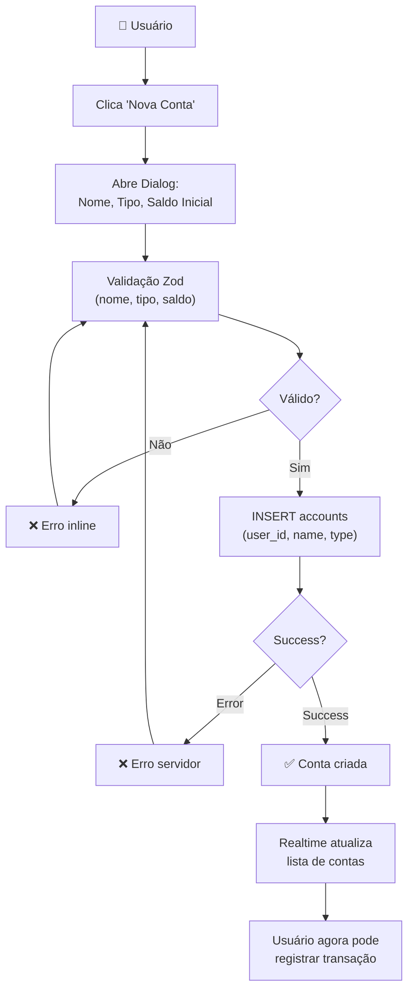
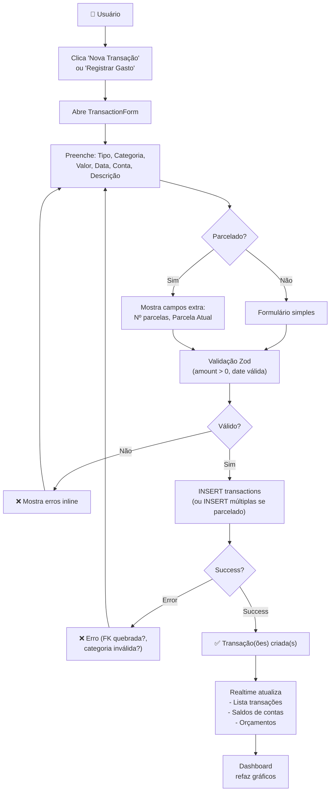
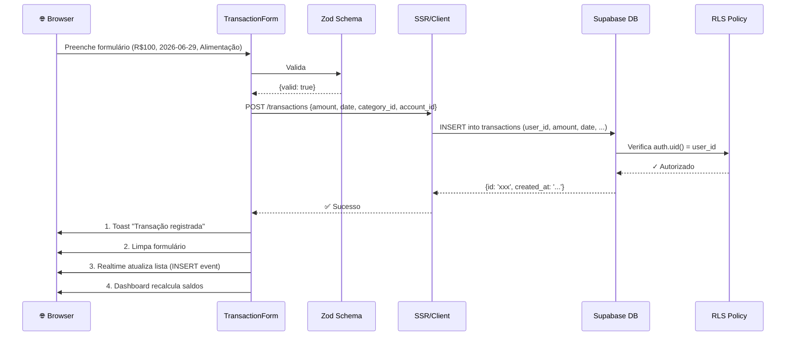
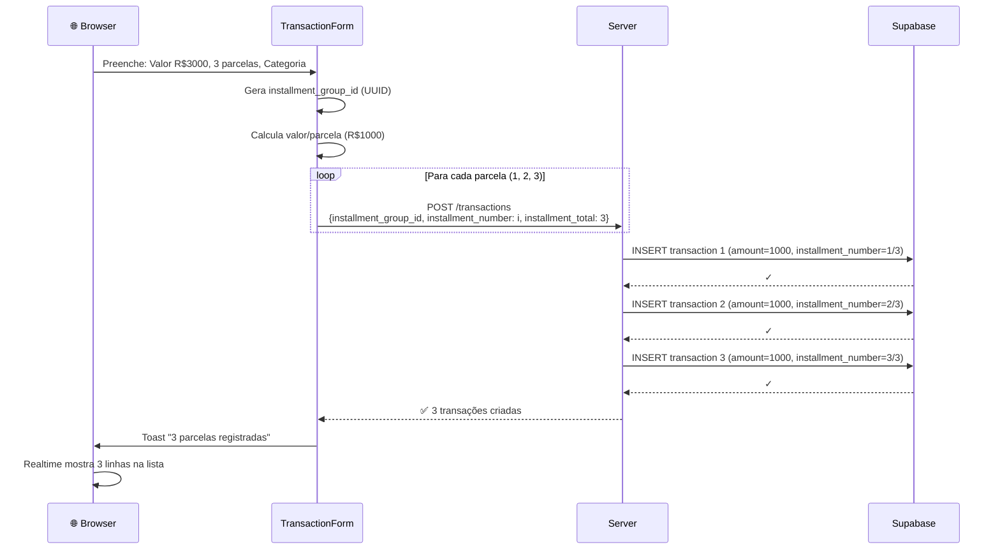
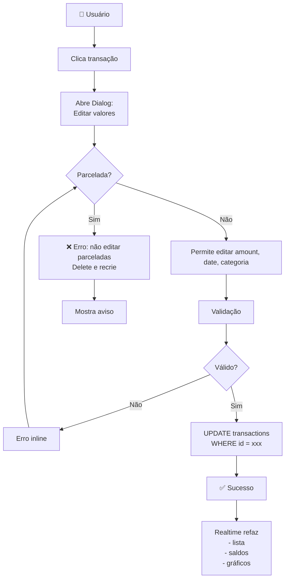
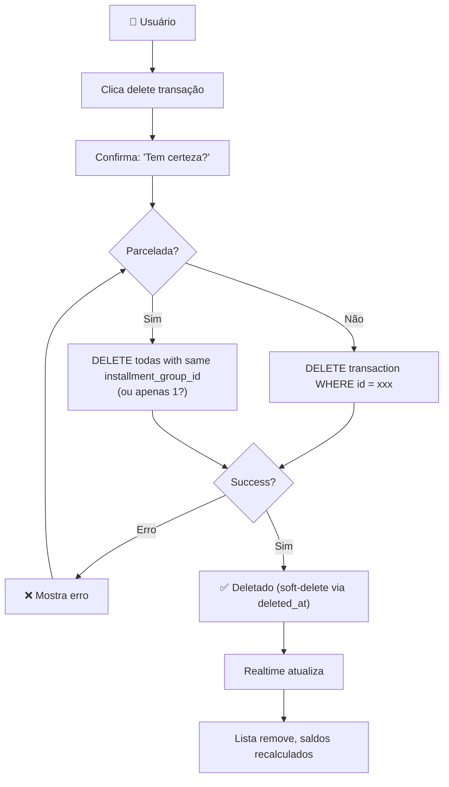

# 💰 Contas e Transações

Fluxo completo de gerenciar contas e registrar transações (receitas, despesas e parcelamentos).

---

## 📊 Diagrama: Criar Conta



---

## 📊 Diagrama: Criar Transação



---

## 🔐 Sequência Detalhada: Criar Transação Simples



---

## 🔐 Sequência Detalhada: Criar Transação Parcelada



---

## ⚠️ Problema: Editando Parcelamento

```
Cenário: Usuário criou 3 parcelas de R$1000
        Agora quer editar a parcela 1 para R$900

Opções:
1. Permitir edição simples
   ❌ Inconsistência (parcela 1 ≠ parcela 2 e 3)
   
2. Exigir deletar + recriar todas
   ✅ Consistência garantida
   ⚠️ Perde histórico
   
3. Calcular diferença para próximas parcelas
   ✅ Lógica complexa
   ⚠️ Outro valor a configurar
   
🎯 IMPLEMENTAÇÃO ATUAL: Opção 2
   - Se deletar qualquer parcela, delete todas com mesmo installment_group_id
   - Para editar, delete tudo e recriar
```

---

## 🔄 Fluxo: Editar Transação



---

## 🗑️ Fluxo: Deletar Transação



---

## 💳 Tipos de Conta

| Tipo | Uso | Campos especiais |
|------|-----|-----------------|
| **checking** | Conta corrente | Saldo livre |
| **savings** | Poupança | Saldo investido |
| **wallet** | Carteira (cash) | Saldo em espécie |
| **credit_card** | Cartão de crédito | credit_limit, saldo é negativo |
| **investment** | Investimentos | Saldo em ativos |
| **other** | Genérico | Saldo livre |

---

## 📊 Tipos de Transação

| Campo | Valores | Notas |
|-------|---------|-------|
| `kind` | income, expense | Tipo principal |
| `income_type` | salary, freelance, investment, sale, gift, refund, dividends, other | Apenas se `kind = income` |
| `payment_method` | cash, debit, credit, pix, bank_slip, transfer | Como foi pago |
| `status` | paid, pending | Pago ou apenas previsto |

---

## 🧮 Cálculo de Saldo

```
Saldo de Conta = initial_balance + SUM(
  CASE WHEN kind='income' THEN amount ELSE -amount END
  FROM transactions 
  WHERE account_id = X 
  AND deleted_at IS NULL
)

Exemplo:
- Initial balance: R$1000
- Receita (salary) +R$3000: total = R$4000
- Despesa (food) -R$200: total = R$3800
- Despesa (parcelada) -R$100 × 3: total = R$3500
```

**⚠️ Nota:** Saldo é calculado em tempo real (não armazenado em DB).

---

## 🎯 Validações (Zod Schema)

```typescript
const transactionSchema = z.object({
  kind: z.enum(['income', 'expense']),
  amount: z.number().positive('Deve ser > 0'),
  date: z.string().refine(d => new Date(d) <= new Date(), 'Data não pode ser futura'),
  category_id: z.string().uuid('Categoria inválida'),
  account_id: z.string().uuid('Conta inválida'),
  description: z.string().max(255).optional(),
  payment_method: z.enum(['cash', 'debit', 'credit', 'pix', 'bank_slip', 'transfer']).optional(),
  status: z.enum(['paid', 'pending']).default('paid'),
  is_recurring: z.boolean().default(false),
  installment_number: z.number().int().optional(),
  installment_total: z.number().int().optional(),
  // Se parcelada, ambos devem estar presentes
}).refine(
  (data) => {
    if (data.installment_number && !data.installment_total) return false;
    if (data.installment_total && !data.installment_number) return false;
    return true;
  },
  { message: 'Número e total de parcelas devem estar juntos' }
);
```

---

## ⚠️ Edge Cases

### 1. Deletar conta com transações
```
Transação tem FK (account_id) → RESTRICT
Se deletar account, DELETE transactions falha
Solução: App deve avisar "Transações ainda referem essa conta"
e oferecer opção de reparamenter antes de deletar
```

### 2. Parcelamento com parcela 0
```
installment_number = 0 (ou null)?
❌ Inválido — sempre começa em 1
Validação Zod deve rejeitar
```

### 3. Transação futura
```
User registra gasto "amanhã"
✅ Permitido (status = pending)
Dashboard mostra "Receitas/Despesas Pendentes" separado
```

### 4. Editar categoria da transação
```
Transação era de "Alimentação" (id_cat_1)
User quer mudar para "Saúde" (id_cat_2)
✅ UPDATE transactions SET category_id = id_cat_2
⚠️ Orçamento antigo não se refaz (histórico)
```

---

## 🧪 Teste: Checklist

- [ ] Criar conta → lista se atualiza?
- [ ] Criar transação simples → saldo da conta muda?
- [ ] Criar parcelamento 3x → 3 linhas na lista?
- [ ] Editar transação simples → dados atualizam?
- [ ] Tentar editar parcelada → mostra erro?
- [ ] Deletar transação → lista atualiza, saldo recalcula?
- [ ] Deletar conta com transações → erro "não pode deletar"?
- [ ] Mudar categoria transação → orçamento da categoria antiga se refaz?
- [ ] Registrar transação futura (pending) → aparece na lista?

---

## 📚 Relacionado

- **Banco de Dados:** [[../Arquitetura/Banco-de-Dados.md]]
- **TransactionForm:** [[../Sistemas/TransactionForm.md]]
- **Queries React:** [[../Sistemas/Queries-React.md]]
- **Orçamentos:** [[Orcamentos-e-Metas.md]]

---

**Versão:** 1.0  
**Última atualização:** 2026-06-29
