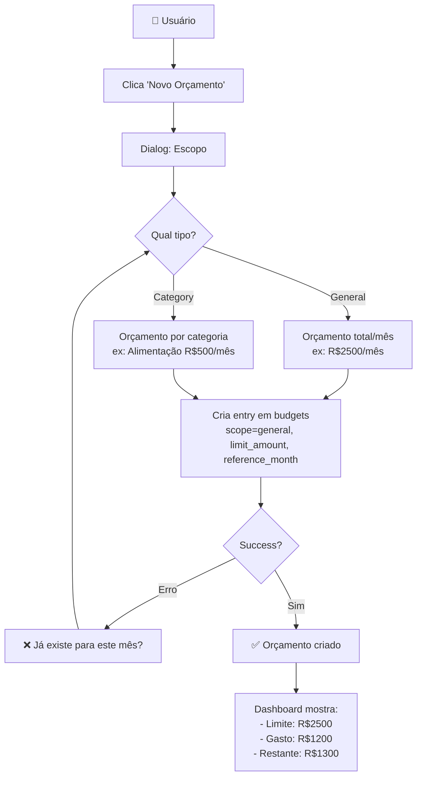
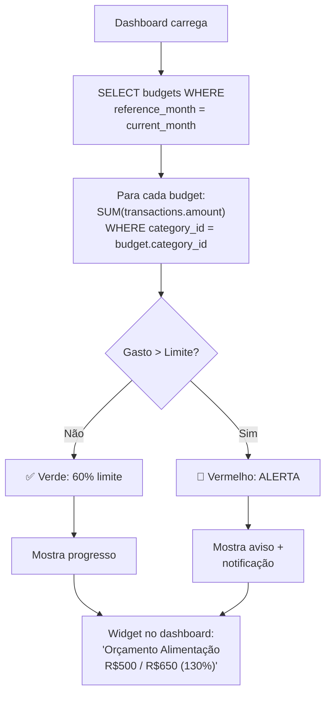
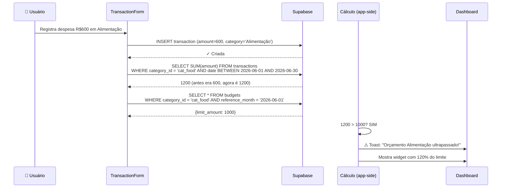
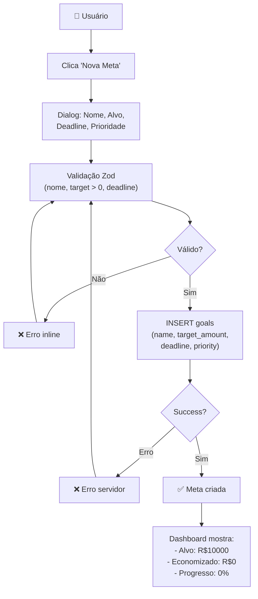

# 💎 Orçamentos e Metas

Fluxo de definir orçamentos, acompanhar metas e alertas quando ultrapassados.

---

## 📊 Diagrama: Definir Orçamento



---

## 🎯 Diagrama: Acompanhar Orçamento



---

## 📊 Sequência: Checar Orçamento ao Inserir Transação



---

## 💡 Fluxo: Criar Meta Financeira



---

## 📊 Acompanhamento de Meta

```
Meta: Viagem para Miami
├── Target: R$10.000
├── Deadline: 2026-12-31
├── Saved: R$3.500
├── Progress: 35%
├── Priority: High
└── Status: Active

Visual (Progress Bar):
[████░░░░░░] 35%
```

**Cálculo:** `progress = (saved_amount / target_amount) * 100`

---

## ⚠️ Problema: Sincronizar Meta com Transações

```
Cenário: Meta "Viagem Miami" com saved_amount = R$3500
         Usuário registra nova despesa "R$500 para viagem"
         
❌ PROBLEMA: saved_amount NÃO sincroniza automaticamente
             Continua em R$3500, deveria ser R$4000

✅ SOLUÇÃO 1: Usuário edita meta manualmente
             Clica "Adicionar R$500" → salva

✅ SOLUÇÃO 2: Vincular transação à meta
             Ao registrar, marcar "Para meta X"
             Sistema calcula saved_amount = SUM(transações da meta)

🎯 IMPLEMENTAÇÃO ATUAL: Solução 1 (manual)
                        Solução 2 é feature futura
```

---

## 🧮 Cálculo: Orçamento Mensal

```
reference_month = '2026-06-01'

Despesas de Junho:
- 06/01: Alimentação -R$200
- 06/05: Alimentação -R$150
- 06/10: Lazer -R$300
- 06/15: Alimentação -R$400
- 06/20: Transporte -R$100

Total Alimentação: R$750
Orçamento Alimentação: R$1000
Restante: R$250
Percentual: 75% do orçamento

---

Orçamento General (soma todas categorias):
Total: R$750 + R$300 + R$100 = R$1150
Orçamento General: R$2500
Restante: R$1350
Percentual: 46% do orçamento
```

---

## 🎯 Validações (Zod)

```typescript
const budgetSchema = z.object({
  scope: z.enum(['general', 'category']),
  category_id: z.string().uuid().optional(),
  limit_amount: z.number().positive('Limite deve ser > 0'),
  reference_month: z.string().refine(
    (date) => /^\d{4}-\d{2}-01$/.test(date),
    'Deve ser primeiro dia do mês (YYYY-MM-01)'
  ),
}).refine(
  (data) => {
    if (data.scope === 'category' && !data.category_id) return false;
    if (data.scope === 'general' && data.category_id) return false;
    return true;
  },
  { message: 'Category obrigatória se scope=category' }
);

const goalSchema = z.object({
  name: z.string().min(2).max(100),
  target_amount: z.number().positive('Alvo deve ser > 0'),
  saved_amount: z.number().nonnegative().default(0),
  deadline: z.string().refine(
    (date) => new Date(date) > new Date(),
    'Deadline deve ser no futuro'
  ),
  priority: z.enum(['low', 'medium', 'high']).default('medium'),
  status: z.enum(['active', 'completed', 'archived']).default('active'),
});
```

---

## 🚨 Alertas

### Alerta 1: Orçamento Ultrapassado

```
Condição: SUM(transações) > budget.limit_amount
Exibição: ⚠️ Toast vermelha no topo + widget dashboard
Mensagem: "Orçamento Alimentação ultrapassado em R$150"
Ação: Usuário clica → Dialog com histórico de despesas
```

### Alerta 2: Meta Próxima ao Deadline

```
Condição: deadline - hoje <= 30 dias E progress < 100%
Exibição: ⚠️ Notificação (se habilitado)
Mensagem: "Meta 'Viagem Miami' vence em 20 dias (35% realizado)"
Ação: Usuário clica → Dialog com opções
       - Aportar valor
       - Prorrogar deadline
       - Arquivar meta
```

### Alerta 3: Meta Completada

```
Condição: saved_amount >= target_amount
Exibição: ✅ Toast verde + confete animation
Mensagem: "Parabéns! Meta 'Viagem Miami' foi atingida!"
Ação: Atualiza status → 'completed'
```

---

## 🧪 Teste: Checklist

- [ ] Criar orçamento general → dashboard mostra limite?
- [ ] Criar orçamento por categoria → filtra correto?
- [ ] Registrar despesa acima do limite → mostra alerta?
- [ ] Criar meta futura → aparece na lista?
- [ ] Editar meta (valor, deadline) → atualiza?
- [ ] Marcar meta como completa → status muda?
- [ ] Deletar orçamento → widget desaparece?
- [ ] Orçamento de mês passado → não aparece mais?
- [ ] Múltiplas metas → cada uma acompanha progress?

---

## 📚 Relacionado

- **Banco de Dados:** [[../Arquitetura/Banco-de-Dados.md]]
- **Contas e Transações:** [[Contas-e-Transacoes.md]]
- **Queries React:** [[../Sistemas/Queries-React.md]]

---

**Versão:** 1.0  
**Última atualização:** 2026-06-29
